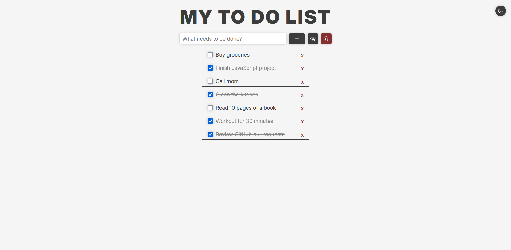
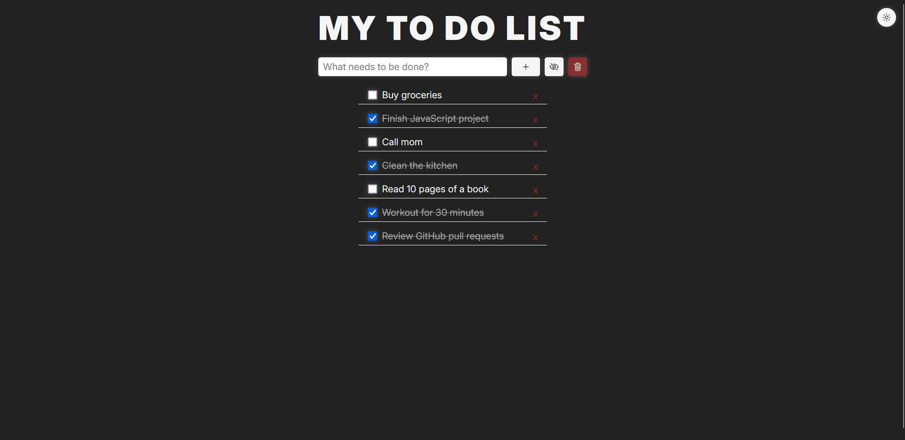

# 📝 My To-Do List

A modern, responsive and themeable To-Do List built using HTML, CSS and JavaScript.

This project was created as a personal challenge to improve my front-end development skills, focusing on clean design, functionality, and user experience.

---

## 💡Features

- 🌓 Toggle between Light and Dark themes
- 🧠 Tasks are saved with LocalStorage
- ✏️ Mark tasks as completed
- ❌ Remove individual tasks or clear all
- 👁️ Hide and show completed tasks
- 📱 Fully responsive layout

---

## 🖼️ Preview

### ☀️ Light Mode

### 🌙 Dark Mode

---

## 🚀 Live Demo

🔗 [Click here to try it now](https://lwyz1912.github.io/todo-list/)

---

## 🛠️ Technologies Used

- HTML5
- CSS3
- JavaScript
